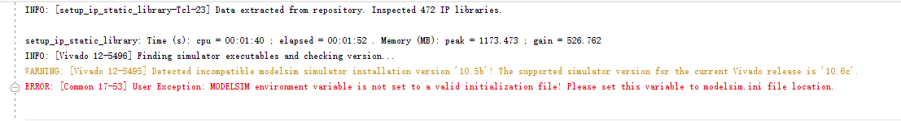
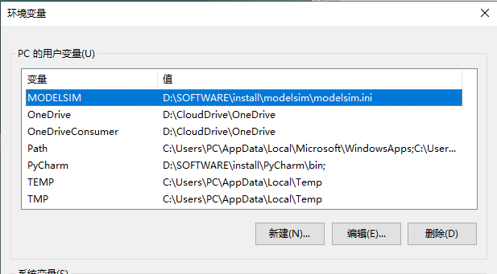
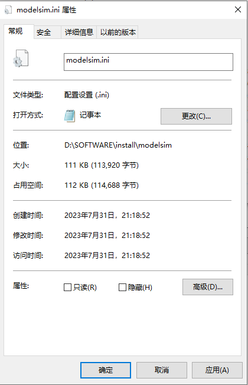

vivado 和modelsim 联合仿真编译仿真库错误解决

错误提示：ERROR: [Common 17-53] User Exception: MODELSIM environment variable is not set to a valid initialization file! Please set this variable to modelsim.ini file location.

解决办法：

将ini文件设为**用户环境变量**，

并且，将该文件设置：**取消只读权限**。

然后即可成功编译。