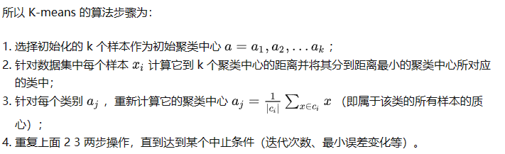
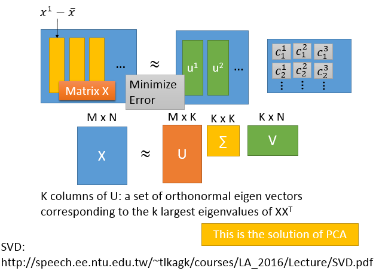
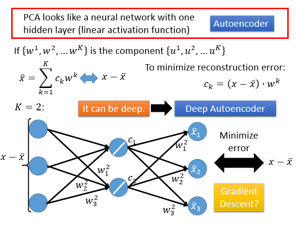

研2217 高伟

2220321236

[TOC]

# 10-1unsupervised learning

无监督学习的分类：

- 化繁为简：cluster、dimension reduction
- 无中生有：Generation

## 聚类

### K-means

k-means算法就是将 n个数据点进行聚类分析，得到 k个聚类，使得每个数据点到聚类中心的距离最小，算法会将数据集分为 K 个簇，每个簇使用簇内所有样本均值来表示，将该均值称为“质心”。

### 层次聚类

层次聚类(Hierarchical Clustering)是聚类算法的一种，通过计算不同类别数据点间的相似度来创建一棵有层次的嵌套聚类树。在聚类树中，不同类别的原始数据点是树的最低层，树的顶层是一个聚类的根节点。创建聚类树有自下而上合并和自上而下分裂两种方法。

聚类完成之后，可在任意层次横切一刀，得到指定数目的簇。

## 降维

如果原来x*是一个非常high dimension的东西，比如image，现在用它的特值来描述，它就会从比较高维的空间变成比较低维的空间。那这件事情就被叫做：dimension reduction。

在做dimension reduction的时候，我们要做的事情就是找一个function，这个function的input是一个vector x，output是另外一个vector z。但是因为是dimension reduction，所以output这个vector z这个dimension要比input这个x还要小，这样才是在做dimension reduction。

### 特征选择

dimension reduction里面最简单是feature selection.

方法是：把data分布拿出来看一下，本来在二维的平面上，但是你发现都集中在x2维，这个x1维没什么用，把它拿掉就只有x2维，相当于是dimension reduction了。

### 主成分分析

Principe component abalysis(PCA)：这个function是一个很简单的linear function，这个input x跟这个output z之间的关系就是一个linear transform，你把这个x乘上一个w，你就得到它的z。现在要做的事情就是：把w找出来。

#### 数学推导

把w1,w2,...排起来成W，W是一个正交矩阵

怎么解w1,w21,w2?

用拉格朗日乘子法。$\overline {z_1}$是$z_1$的均值，$\overline {z_1}$是summation over所有$w_1$跟x的内积，summation 跟$w_1$无关，把$w_1$提出来变为$\overline {z_1}=w^1\cdot\sum x=w_1\cdot\overline x $，得到$w_1$跟x的平均的内积。

#### 主成分分析的另一个角度

用SVD将X拆成这三个matrix相乘，那右边三个matrix相乘的结果是最接近左边这个matrix的，那解出来的结果是什么样呢？其中U这个matrix的 K columns其实就是一组orthonormal vector，这组orthonormal vector是$X\cdot X^T$的eigenvector，U总共有K个orthonormal vector，这K 个orthonormal vector对应到$X\cdot X^T$最大的k个eigenvalue的eigenvector。

这个$X\cdot X^T$就是covariance matrix，PCA之前找出的W就是covariance matrix的eigenvector。而我们这边说做SVD，解出来U的每个column就是covariance matrix的eigenvector，所以这个U得出的解就是PCA得到的解。所以我们说：PCA做的事情就是：你找出来的那些W其实就是component。

#### 主成分分析和神经网络

#### 缺点

- unsupervised
- Linear
