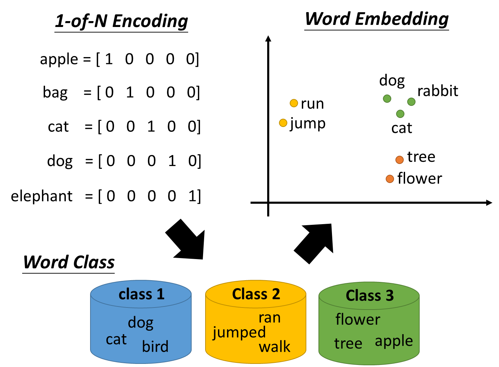
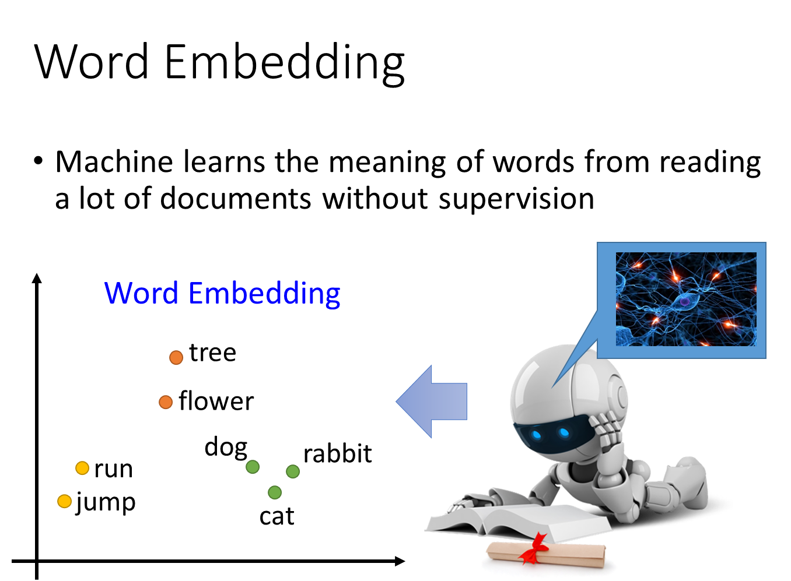
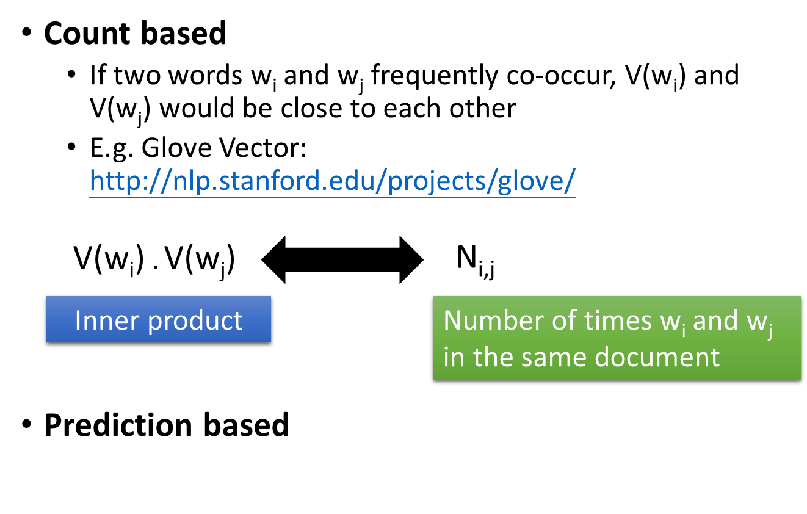
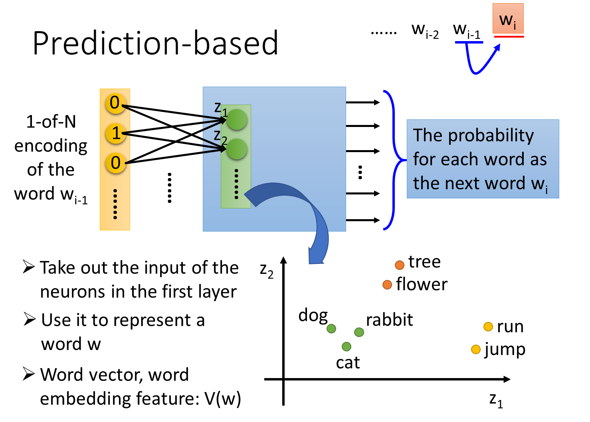
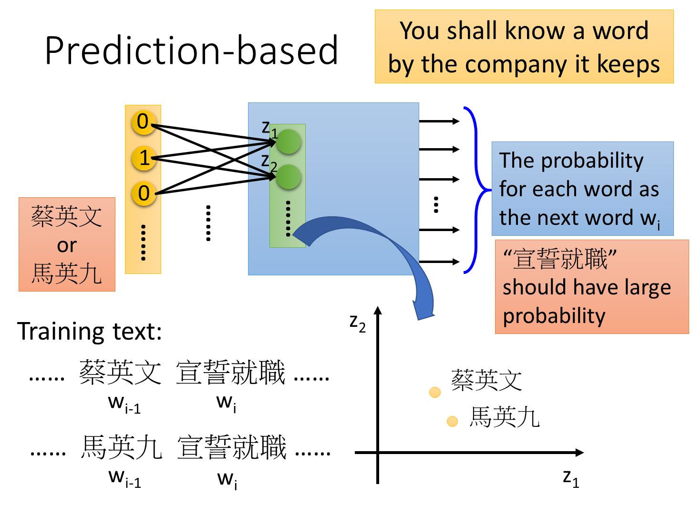
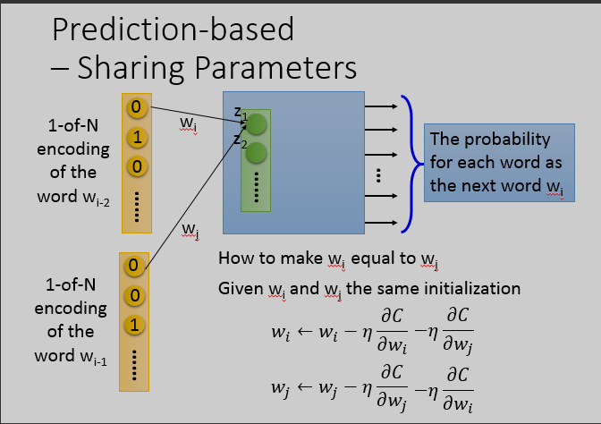
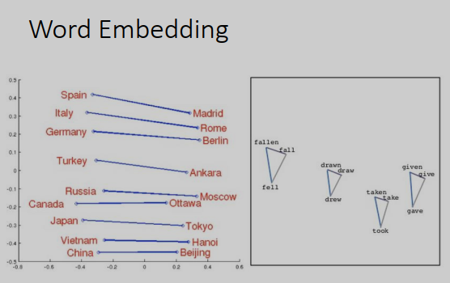

研2217 高伟

2220321236

[TOC]

# 10-2 word embedding

如果要用一个vector来表示word

- 最典型的做法是1-of-N encoding。每一个词用一个向量表示，向量的维度就是所有可能的词的数量，假如有10万个，那1-of-N encoding的维度就是十万维。每一个词，对应其中一维，apple就是第一维是1，其他是0，bag第二维是1，其他事0，以此类推。用这种方式描述一个词，这个描述向量信息不丰富，不同词的词向量都是不同的，那就没办法知道词与词之间的关系，比如dog和cat都是动物这件事就没办法知道。

- word class：就是把不同的word，但有同样性质的word，把他们class成一群一群的，然后用那个word所属的class来表示这个word。
- word Embedding：把每一个word都project到high dimension sapce上面，我们希望可以从这个word Embedding图上可以看到的结果是：类似同一个语义的词汇，在这个图上是比较接近的。而且在这个high dimension space里面，每一个dimension可能都有它特别的含义。

这是一个非监督的问题，我们要做的事情就是学习一个神经网络，找一个函数，input是一个词汇，output就是词汇对应的词嵌入向量。而我们的训练数据是一大堆的文字，只有input，不知道每一个词嵌入向量应该长什么样子。

让机器阅读大量文章，就可以让它知道每个词的嵌入特征向量应该长什么样子。

## 基于计数的词嵌入

count based：如果我们现在有两个词汇$w_i,w_j$，他们的word vector(用$V(w_i),V(w_j)$来表示)，如果$w_i,w_j$它们常常在同一个文章出现，那他们的$V(w_i),V(w_j)$会比较接近。代表性的方法是Glove vector。

这个方法的原则是这样，假设我们知道$w_i$的word vector是$V(w_i),w_j$的word vector是$V(w_j)$，我们可以计算$V(w_i),V(w_j)$的inner product，假设��,�*N**i*,*j*是$w_i,w_j$他们在同一个document的次数，希望这两件事情（内积和同时出现的次数）越接近越好。这个概念跟我们之前将的matrix factorozation的概念其实是一样的。

## 基于预测的词嵌入

基于预测的词嵌入，学习一个神经网络，在序列中，给定前一个词汇$w_{i-1}$，预测下一个词汇$w_i$是什么。我们可以把每个词汇用1-of-N encoding表示成一个特征向量，那么神经网络的input 就是$w_{i-1}$的1-of-N encoding向量，output是$w_{i}$为某个词汇的概率。

如果神经网络是一般的深度网络结构，那input经过很多层隐藏层后，得到output。接下来我们把第一个隐藏层的input拿出来，写作$Z={z_1,z_2,...}$ ，input不同词汇的1-of-N encoding向量，Z也会不同，那么Z就可以代表一个词汇，Z就是词嵌入向量。

### 共享参数

如果我们不这样做，

- 同一个的word放在$w_{i-2}$的位置跟放在$w_{i-1}$的位置，通过这个transform以后，它得到embedding就会不一样。

- 可以减少参数量，那你就不会随着你的context增长，而需要更多的参数。

###  训练

这个训练是Unsupervised的，只需要collect一大堆的文字data(爬虫)，然后就可以train model了。

把一个词汇的1-of-N encoding乘上这个W，就可以得到这个词汇的词嵌入向量。

要让$W_i,W_j$一样，首先要给$W_i,W_j$一样的初始化，接下来计算损失函数C对$W_i$的偏微分，更新$W_i$；同样计算损失函数C对$W_j$的偏微分，更新$W_j$。

我们在更新$W_i$的时候再减掉$W_j$的偏微分，更新$W_j$的时候再减掉$W_i$的偏微分，确保$W_i,W_j$在更新过程中是一样的。

## 不同的变形

- 连续词袋（continuous bag of word model，CBOW）。之前是说拿前面的词汇去预测后面的词汇，CBOW则是拿待预测词汇的上下词汇，拿$w_{i−1},w_{i+1}$去预测$w_i$。
- 有一种变形叫做Skip-gram，拿$w_i$去预测$w_{i−1},w_{i+1}$。

## 词向量特性

从词向量里，可以发现词与词之间的关系。

如果把同样类型的东西的词向量放在一起，如上图左边，把Italy和它的首都Rome放在一起，把Germany和它的首都Berlin放在一起，你会发现它们之间有某种固定的关系。

或者把动词的三态放在一起，会发现同一个动词的三态有某种固定的关系（三角形）。

用词向量的概念，可以做一些简单的推论。

如果hotter的词向量-hot的词向量接近于bigger的词向量-big的词向量

或者Rome的词向量-Italy的词向量接近于Berlin的词向量-Germany的词向量。

如果有人问，罗马之于意大利就好像柏林之于什么，那么机器就可以回答这种问题了。

### 多语言嵌入

已经事先知道某几个中文词汇和英文词汇是对应的，那先得到一组中文词向量，再得到一组英文词向量，接下来可以再训练一个model，把中文和对应英文都投影到同一点。

有了这个transform之后，有新的中文和新的英文词汇时，可以用同样的transform投影到同一个空间上面。比如中文“降低”和英文“reduce”落在差不多的位置。这样就可以做到类似翻译的效果。

### 多域嵌入

词嵌入方法不只限于文字，你可以对影像做嵌入。

