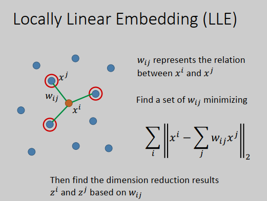
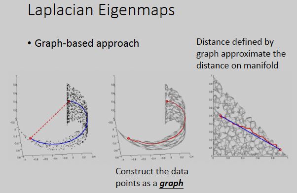
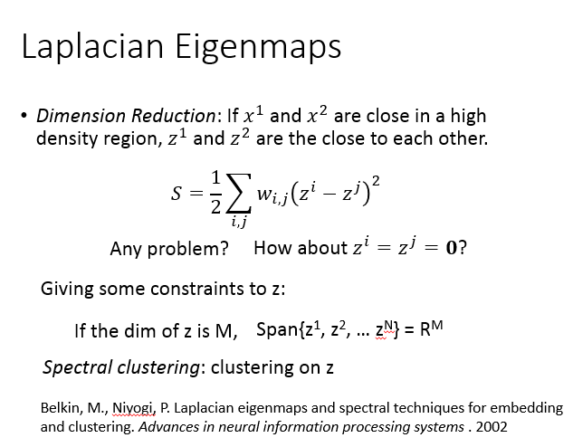
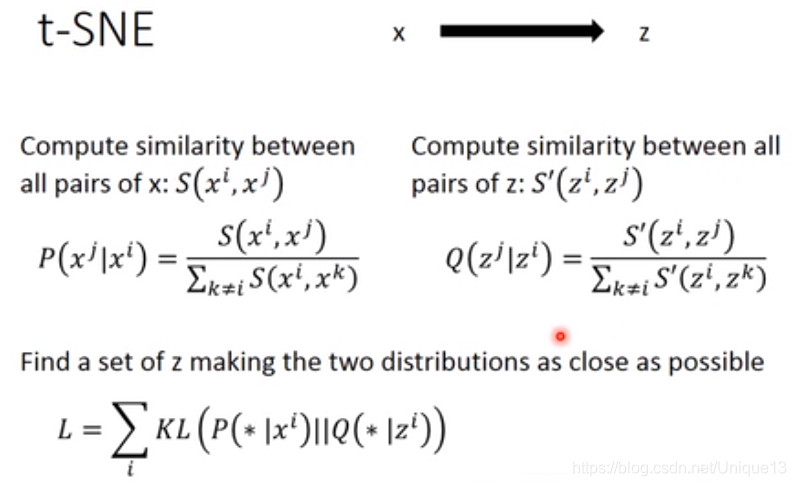
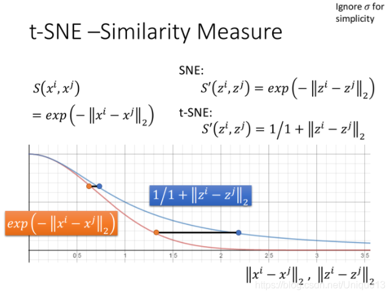

研2217 高伟

2220321236

[TOC]

# 10-3领域嵌入

现在要做的事情就是之前讲过的降维，只不过是非线性的降维.

## Locally Linear Embedding（局部线性嵌入）

这个方法意思是说：在原来的空间里面，有某一个点叫做$x^i$，我们先选出$x^i$的neighbor叫做$x^j$。接下来我们找$x^i$跟$x^j$之间的关系，它们之间的关系我们写作$w_{ij}$。

找出$w_{ij}$：

假设每个$x^i$都可以由它的邻近点做线性组合而成，那$w_{ij}$就是线性组合的权重。现在找一组$w_{ij}$，让$x^i$的所有邻近点$x^j$的线性组合${\sum}_j{w_{ij}x^j}$和$x^i$越接近越好，损失函数就是summation over所有的$x^i$，使得2-norm越小越好。

接下来就要做降维，把原来所有的$x^i,x^j$转成$z^i,z^j$，这里的原则是中间的$w_{ij}$是不变的。

- LLE没有一个明确的函数告诉你说怎么做降维，不像在做auto-encoder的时候，学习一个encoder的网络，input一个新的数据点，就可以得到降维的结果。

- LLE不会让你找到一个明确的函数，告诉我们说怎么从x变到z，z就是另外凭空找出来的。

- 如果用LLE或者其它类似的方法会有一个好处，就算不知道原来的$x^i$,$x^j$，只知道$w_{ij}$，即不知道$x^i$,$x^j$j用什么向量来描述，只知道它们之间的关系，也可用LLE这种方法。

- 用LLE需要好好调整邻近点的个数K，个数要合适才会有好的结果。原始论文里调了不同的K，K太小和K太大得到的结果都不太好。
- 只有在距离很近的时候，才可以近似用欧式距离计算，所以点和点之间关系，在转换前后才可以被保持住。当K很大的时候，就会包括一些距离比较远的点，和这些点的关系在转换后就没办法保持住，有些关系太弱了。

## 拉普拉斯特征映射

拉普拉斯特征映射是一种基于图的降维算法，它希望相互间有关系的点（在图中相连的点）在降维后的空间中尽可能的靠近，从而在降维后仍能保持原有的数据结构。

## t-SNE（t-distributed stochastic neighbor embedding)（t分布随机邻居嵌入）

这种算法不仅要求相邻的点要接近，还要要求不相近的点要分开。
计算所谓的相邻点的相似度，只是这里我们都进行了归一化处理，这样才有利于去使用KL散度来计算这两个分布的相似程度，让这个L LL越小越好。

给t-SNE一个新的数据，它就没办法处理，只能处理训练集x，帮你找到z，找完训练集的z之后，再给它一个新的x，你就要重新做一遍t-SNE，很麻烦。所以t-SNE常常用来做可视化。

t-SNE的这个相似度的选择非常神妙。在原来的空间上，x相似度的选择是RDF的函数，计算$x^i x^j$的欧式距离，然后取负号，再取exp。

在图上计算相似度的话，用这种方法会比较好，因为它可以确保只有非常近的点才有值，exp变化很快，只要距离大，相似度就会变得很小。

