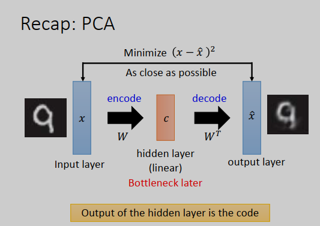
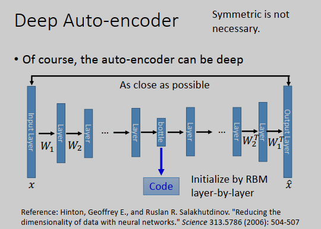
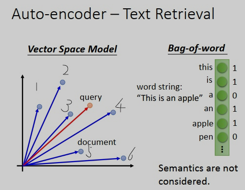
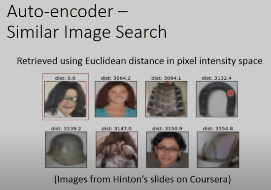
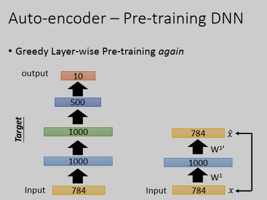
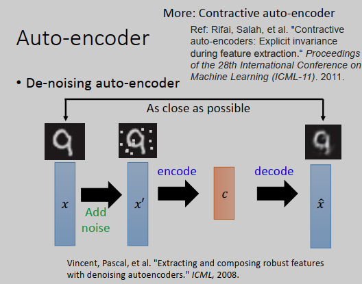
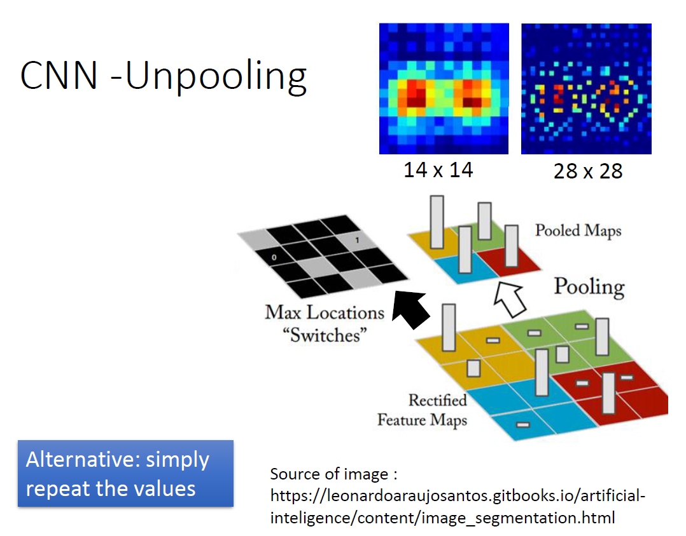
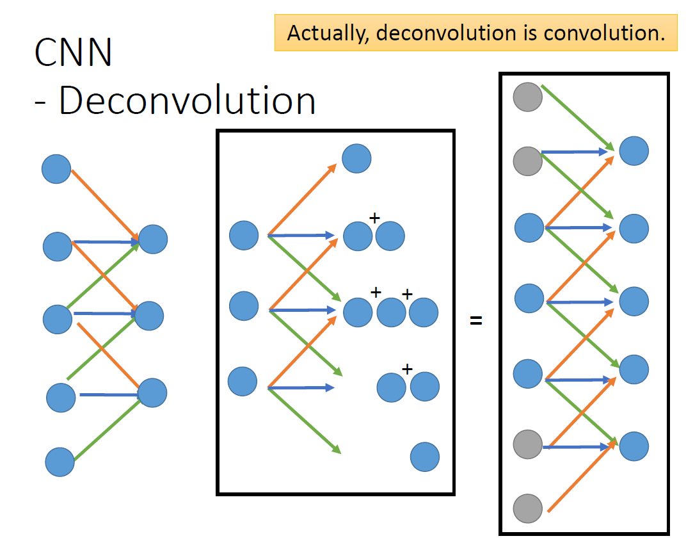

研2217 高伟

2220321236

[TOC]

# 10-4 深度自动编码器(Deep Auto encoder)

降维的时候是使用神经网络

## 自动编码器

把很多隐藏层的神经网络当成编码器，输入一个图像后能得到一个编码。比如传入784维的手写数字，得到的编码通常会小于784维。

训练encoder和decoder，这两个神经网络，encoder和decoder，都没有办法单独训练，但是我们可以把它们接起来，然后一起训练。也就是说input一个图像，变成code，再把code通过decoder变成原来的图像，那encoder和decoder就一起学习。

## Recap:PCA

在PCA里面，我们就是minimize input跟reconstruction的结果。我们要让x跟�^*x*^的Eculidean distance越接近越好，这是PCA做的是事情。如果把它当成neural network来看的话，input x就是input layer，output �^*x*^就是output layer，中间的component weight就是hidden layer(在PCA里面是，它是linear)。那这个hidden layer我们通常叫它Bottleneck later。

在PCA里面遇到过非常类似的概念。PCA做的事情是，input一张图像x，在之前的例子里把x减去平均值$\overline x$后当做input，这边我们把$\overline x$省略掉，因为通常做NN的时候，都会先对数据做标准化（均值为0，方差为1），所以$\overline x$一般就等于0了。

把x乘上一个权重（W，成分向量组成的矩阵），经过一个线性隐藏层得到c，这个c是对应成分的权重，c再乘以矩阵W的转置得到$\hat x$，$\hat x$是成分的线性组合重构而成。

在PCA里面要做的事情就是最小化x和$\hat x$ 的欧式距离。把PCA看成神经网络的话，x就是input layer，$\hat x$就是output layer，中间成分权重c就是一个线性的隐藏层。中间这个隐藏层我们通常叫做bottleneck layer。

c前面的部分就是在做encode，c后面的部分就是在做decode。如果把成分的权重c看成是code的话，那么decoder就是把code变回原来的图像。

隐藏层的output，就是我们要找的code。

PCA就是这么做的，也可以使用梯度下降求解W

PCA只有一个隐藏层，那我们可以加入更多的隐藏层，可以兜一个很深的神经网络，有很多很层。input一个x
，得到$\hat x$，训练目标是x,$\hat x$越接近越好，参数就用反向传播进行学习。中间会有一个特别窄的层（神经元很少），这个层的output就是一组code。从input到bottleneck layer的部分就是encoder，从bottleneck layer到$\hat x$
就是decoder。

## 自动编码器 - 文本检索

auto-encoder也可以用在文字处理上，比如我们想把一篇文章压成一个向量，压成一个code。

一个最基本的方式叫词袋，词袋的思想就是构造一个向量，向量大小是词典的大小，假设世界上有十万个词汇，那这个向量的大小就是十万维。

用词袋模型效果很弱，没有办法考虑语义相关的东西，不知道“apple”跟“orange”都是水果等等。对词袋模型来说，每个词汇都是独立的，词汇没有任何相关性。

可以用auto-encoder让语义被考虑进来,使用词袋模型就把一篇文章变成了一个向量。把这个向量通过一个encoder，把它压成二维.

## 自动编码器 - 类似图像搜索

最简单的方法就是，假设上图是要找的对象（query），计算这个query跟你在图像库里面的图片的相似度，比如可以计算它们在像素点上的相似程度，那么最想的几张就是要检出的结果。

可以用deep auto-encoder把每一张图像变成一个code，然后在code上面再去做搜索，而且学习一个auto-encoder是无监督的，所以你收集多少数据都行。

## 自动编码器-预训练

Auto-encoder过去有一个很好的应用，可以用在预训练上面。我们知道在训练一个神经网络的时候，有时候很烦恼怎么做参数的初始化， 那有没有一些方法可以帮助你找到一组比较好的初始化呢，那可以用auto-encoder来做预训练。

## 降噪自动编码器

有个方法可以让auto-encoder做得更好，叫做降噪自动编码器。

概念很简单，把原来的input x加上一些噪声变成，对x′ encode以后变成code c，再把c decode回来变成$\hat x$，但是要注意本来auto-encoder是让input(x′)跟output($\hat x$)越接近越好，在这里则是让x跟$\hat x$越接近越好，这样学习出来的结果比较鲁棒。encoder不只学习了encode这件事，还学习到了把噪声过滤掉这件事。

## CNN自动编码器

如果要处理的对象是图像的话，我们知道一般用CNN，会有一些卷积层、池化层，卷积和池化交替让图像变得越来越小，最后去做展平（flatten）。

做auto-encoder的话，要有一个encoder和一个decoder，如果encoder的部分是做卷积-池化-卷积-池化，那么理论上decoder应该和encoder做相反的事情（unpooling-deconvolution-unpooling-deconvolution）。但是这个反池化和反卷积到底是什么呢？训练的标准就是让input和output越接近越好。

### 无池化 CNN

一种上采样方法，与pooling相反，用来增加图像的resolution.

### Deconvolution（逆卷积）

deconvolution跟convolution相比较的话，不同点是：它们的weight是相反的，但是它们都做的是convolution这件事

