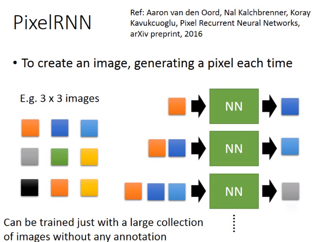
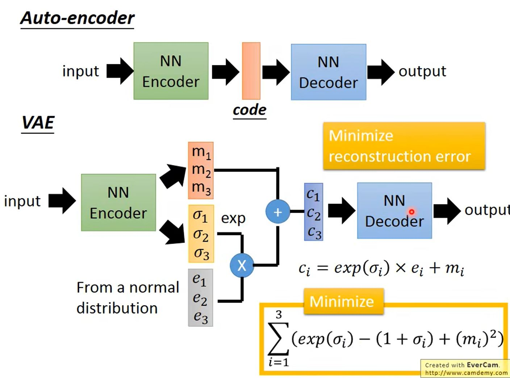
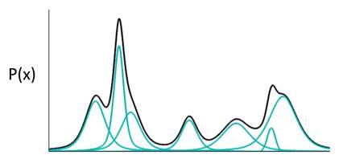
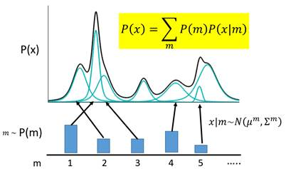
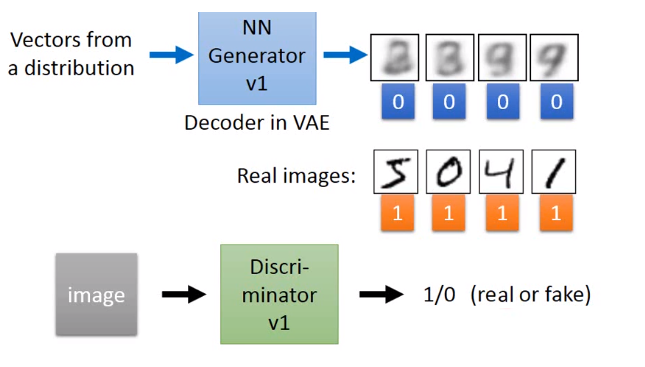
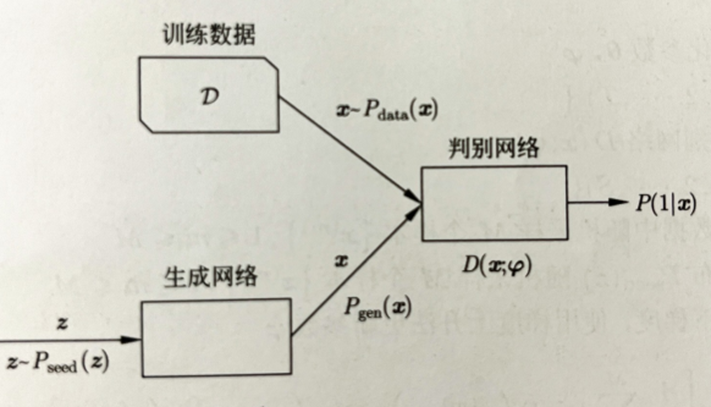

# Lecture 10-5：Unsupervised Learning-Generation

【研2217-高伟-2220321236】

生成模型的想法是希望机器能够自己主动去生成，去创造。

生成模型大概可以分为三个方法。分别是：PixelRNN, VAE, Generative Adversarial Network(GAN)

## PixelRNN

主要是用到RNN，例如要生成一张3*3的图，可以一次生成一个像素，再将其组合起来就可以得到要求的图。此方法能够被大量没有标注的图像进行训练。

上图先随机得到一个像素点值（橙色），将其作为输入用一个RNN网络输出了一个蓝色的像素点；接着用原来的橙色点和生成的蓝色点，两个点作为输入，用RNN网络输出另外一个浅蓝色的点；接着用这已有的三个点作为输入，再重复之前的步骤......直到得到完整的图。

## VAE

VAE最想解决的问题：如何构造编码器和解码器，使得图片能够编码成易于表示的形态，并且这一形态能够尽可能无损地解码回原真实图像。与PCA（主成分分析）有些相似。

### VAE模型结构

在auto-encoder中，编码器是直接产生一个编码的，但是在VAE中，为了给编码添加合适的噪音，编码器会输出两个编码:

- 原有编码 ($m_1,m_2,m_3$)
- 控制噪音干扰程度的编码 ($\sigma_1,\sigma_2，\sigma_3$) ， 为随机噪音码$(e_1,e_2，e_3)$分配权重，然后乘上$exp(\sigma_i)$ 的目的是为了保证这个分配的权重是个正值
- 最后将原编码与噪音编码相加，就得到了VAE在code层的输出结果 $(c_1,c_2,c_3)$。

其它网络架构都与Deep Auto-encoder无异。

### 高斯混合模型

高斯混合模型：任何一个数据的分布，都可以看作是若干高斯分布的叠加。

利用这一理论模型去考虑如何给数据进行编码。一种最直接的思路是，直接用每一组高斯分布的参数作为一个编码值实现编码。

现在编码的对应关系是，每采样一个m，其对应到一个小的高斯分布，P(X)就可以等价为所有的这些高斯分布的叠加，即：

​    其中，，。

编码换成一个连续变量z，我们规定z服从正态分布（实际上并不一定要选用，其他的连续分布都是可行的）。每对于一个采样z，会有两个函数和，分别决定z对应到的高斯分布的均值和方差，然后在积分域上所有的高斯分布的累加就成为了原始分布P(X),即：

​    其中，。

接下来就可以求解这个式子。由于是已知的，未知，而，于是我们真正需要求解的，是和两个函数的表达式。又因为P()通常非常复杂，导致和难以计算，我们需要引入两个神经网络来帮助我们求解。

- 第一个神经网络叫做Decoder，它求解的是和两个函数，这等价于求解。

- 第二个神经网络叫做Encoder，它求解的结果是，可以代表任何分布。

第二个神经网路Encoder的目的是，辅助第一个Decoder求解.

## GAN

GAN由一个生成网络(generator)和一个判别网络(discriminator)组成,相互进行博弈(对抗)。

- 生成网络生成数据(假数据)，判别网络判别数据是已给数据(真数据)还是生成数据(假数据)。
- 学习的过程就是博弈的过程，生成网络和判别网络不断提高自己的能力,当最终达到纳什均衡时,生成网络可以以假乱真地生成数据，判别网络不能判断数据的真假。

- 生成网络和判别网络都是神经网络，训练数据没有直接用于生成网络的学习，而是用于判别网络的学习。

- 判别网络能力提高之后用于生成网络能力的提品，生成网络能力提高之后再用于判别网络能力的提高,不断循环。

- 生成网络用x=G(z;θ)表示，其中z是输入向量，x是输出向量,θ是网络参数。

- 判别网络是一个二类分类器，用P(1|x)=D(x;φ)表示,其中x是输入向量,P(1|x)和1-P(1|x)是输出概率,分别表示输入z来自训练数据和生成数据的概率, 