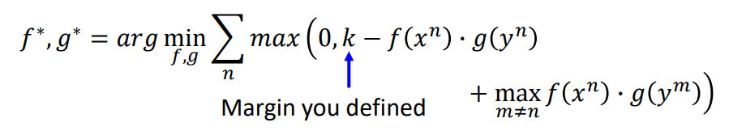

# Lecture 11：Transfer Learning

【研2217-高伟-2220321236】

迁移学习：简单来说，在拥有一些不相干（类型不同/分布不同/....）的data 的情况下，去完成一些分析任务。

## 模型微调

当目标任务的数据（target data）极少，现有的无关数据（source data）比较多时，但两类数据都带标签，适合用此类方法，实际上就是one-shot learning的情况。本质上就是使用现有的带标签的数据训练一个模型，然后在target data上对模型进行微调。

### conservation training

使用source data训练一个模型之后，在使用target data训练模型的时候，增加一些约束，使得两个模型输出比较接近，或者是两个模型的parameter 比较接近

### layer transfer

把基于source data训练好的model的某些layer直接用于新的模型，然后用target data训练剩下的layer的参数。

- 对于语音辨识任务，通常复制的是最后的几层，因为整个模型是将声音讯号学习发音方式，前几层输入声音讯号学习到的是声音的音色语调，后几层学习到的是发音和语义。

- 对于图片而言，通常是复制模型的前面几层，因为深度学习模型前几层学习到的是图像的最通常的模式，比较易于迁移。

## multitask learning 多任务学习

多任务学习前提是task需要在某一层面上是有关联或者是相似的。

多任务学习的成功案例：多语言辨识，因为虽然语言是不同，但是具有一定的通用性。

## domain-adversarial training

当source data是有标签，target data是没有标签的，这个时候，两个数据集是不匹配的，分布是不同的

这时候，希望前面的特征提取器能够将source data的domain特性去除，具体做法是，将feature extractor的输出输入到domain classifier和label classifier，使得模型不仅要能够消除domain的特性，还要能够正确的分类。如下图，显然，这个模型由三部分组成，每部分的目标是不一样的。

模型训练方法：在feature extractor和domain classifier之间加一个gradient reversal layer，即传递的梯度乘负号。这里需要注意的是，domain classifier一定要是一个比较厉害的模型，这样才能在对抗的过程中，真正的消除特征的domain差异性。

## zero-shot learning零样本学习

training data 和testing data是完全不同的，也就是testing data是未出现过的

学习四想：训练的时候学习的目标是学习图片的属性（attribute embedding），测试的时候输出的也是图片的属性，然后找到和属性最近似的类。

寻找一个函数f和g，分别学习样本x的表示和样本属性y的表示。要把图片和图片的属性投影到同一个表示的空间上，目标就是使得图片的表示和图片的属性的表示足够的接近。

目标函数是（图片的表示和图片的属性的表示足够的接近）：

这种表达式是不行的，只会将相同的属性和类都拉进，对于不同类别的图片和属性没有拉远的效果

比较可行的表达式是：

