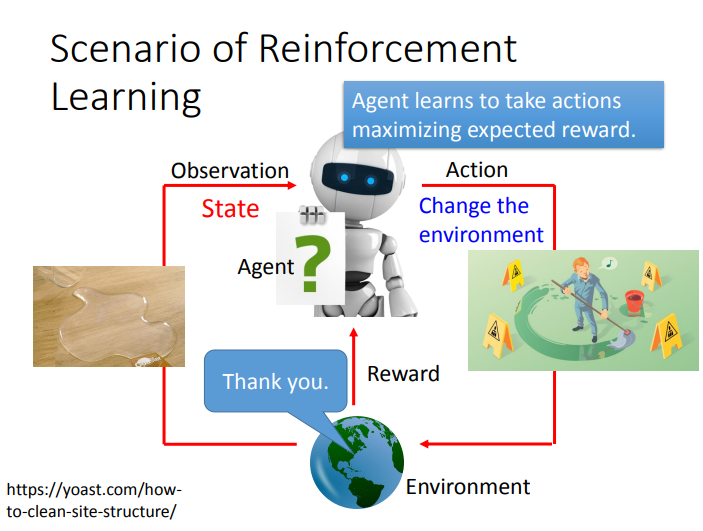
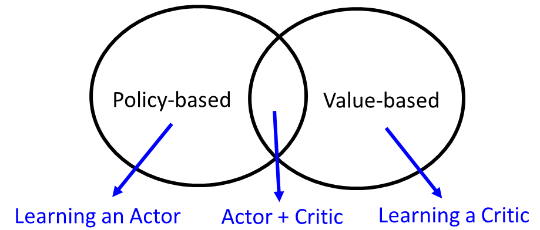
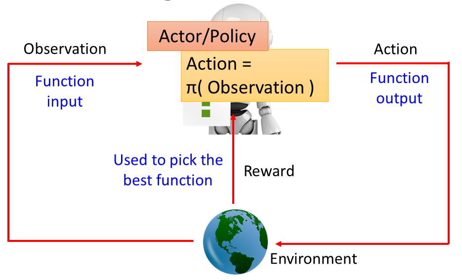
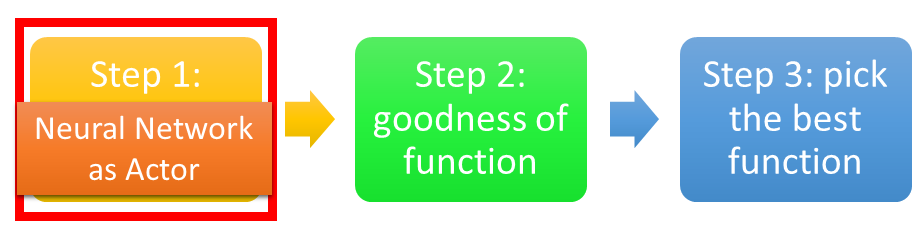
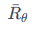
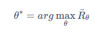
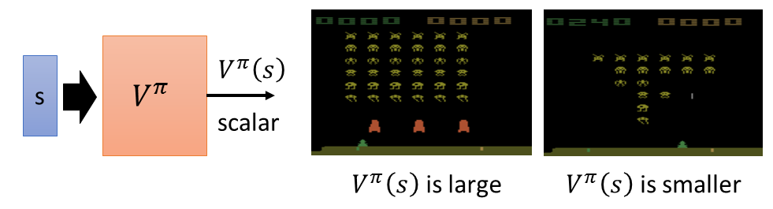
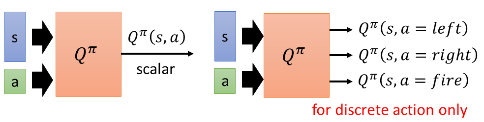
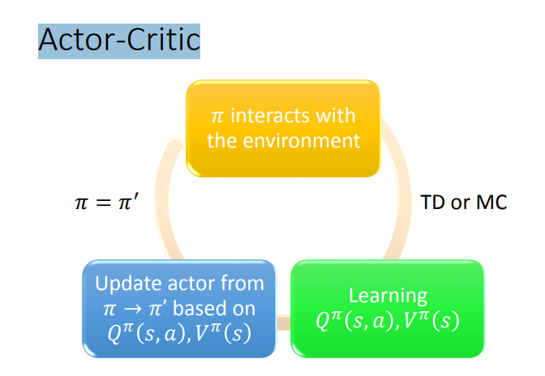

# Lecture 12：Introduction of Reinforcement Learning

【研2217-高伟-2220321236】

[toc]

## 强化学习

强化学习中两个核心的概念就是：「智能体」`agent`和「环境」`environment`。环境表示智能体生存以及交互的世界。每一次交互时，智能体会观察到世界当前所处「状态」state的「观测值」bservation，然后决定采取什么「动作」`action`。环境会随着智能体的动作而发生变化，当然环境自身也可能一直处于变化中。

智能体会从环境中接收到一个「奖励」`reward`信号，这个信号可能是一个数值，表示当前环境所处状态的好坏。智能体的目标是：最大化「累积奖励」`cumulative reward`，也称为「收益」`return`。强化学习方法就表示智能体通过学习行为来达到这个目标的途径。

- 环境（environment）：智能体生存以及交互的世界，譬如熟知的gym环境
- 智能体（agent）：可以是人，可以是网络，甚至古早一点可以是查表之类的映射
- 状态（state）、观测值（observation）、动作（action）
- 智能体的目标：最大化累积奖励（cumulative reward）或最大化期望奖励（expected reward）

Reinforcement 是从过去的经验去学习，没有老师告诉它什么是好的，什么是不好的，machine要自己想办法，其实在做Reinforcement 这个task里面，machine需要大量的training，可以两个machine互相下。alpha Go 是先做Supervised Learning，做得不错再继续做Reinforcement Learning。

## 强化学习的难点

- Reward delay，第一个难点是，reward出现往往会存在delay
- Agent's actions affect the subsequent data it receives，Agent采取行动后会影响之后它所看到的东西，所以Agent要学会去探索这个世界。

## 强化学习的方法

- 基于策略（Policy-based）：学一个actor
- 基于值（Value-based）：学一个critic
- 基于两者：actor-critic

### Policy-based 方法

Actor就是一个Function。Function的input就是Machine看到的observation，output就是Machine要采取的Action。通过reward来帮我们找这个best Function。

找个这个Function有三个步骤：

- Neural Network as Actor

第一个步骤就是决定你的Function长什么样子，假设你的Function是一个Neural Network，就是一个deep learning。

- Goodness of Actor

在Reinforcement Learning里面，一个Actor的好坏的定义是非常类似的。假设我们现在有一个Actor，这个Actor就是一个Neural Network，Neural Network的参数是θ，即一个Actor可以表示为$π_θ(s)$，它的input就是Mechine看到的observation。让这个Actor实际的去玩一个游戏，玩完游戏得到的total reward为 $R_θ=∑_{t=1}^T=r_t$，把每个时间得到的reward合起来，这既是一个episode里面，你得到的total reward。

- Pick the best function

用Gradient Ascent找到目标，就是最大化这个

### Value-based 方法

不学习actor，也就是不学习怎么做事，而是学习一个critic。 Critic就是一个function，这个function可以告诉你说现在看到某一个observation的时候，这个observation有有多好这样。

- 根据actor π评估critic function

    这个function是用Neural Network表示

- state value function$V^\pi(s)$

    这个累加的reward是通过观察多个observation，估计 $V^\pi(s)$可以采用Monte-Carlo based approach。

- State-action value function  $Q^\pi(s)$

    这个累加的reward是通过观察observation和take的action

    

### Actor-Critic

演员-评论家算法(Actor-Critic)是基于策略(Policy Based)和基于价值(Value Based)相结合的方法

- 演员(Actor)是指策略函数 $\pi_\theta(a|s)$，即学习一个策略来得到尽量高的回报。
- 评论家(Critic)是指值函数$V^\pi(s)$，对当前策略的值函数进行估计，即评估演员的好坏。
- 借助于价值函数，演员-评论家算法可以进行单步更新参数，不需要等到回合结束才进行更新。

- Actor使用策略函数，负责生成动作(Action)并和环境交互。而Critic使用价值函数，负责评估Actor的表现，并指导Actor下一阶段的动作。

